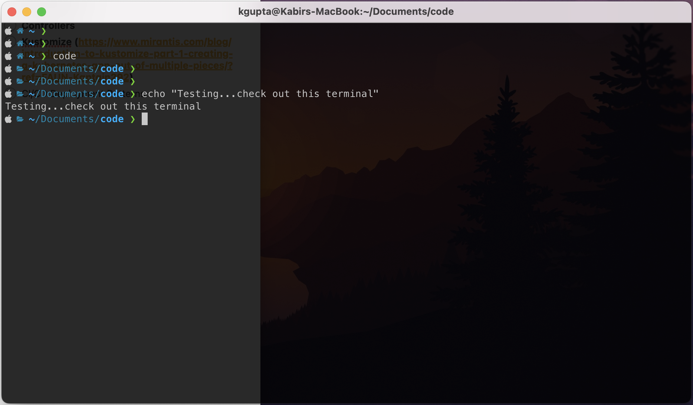

# macbook_setup

1. Run `setup.sh` to install useful software on your Macbook including:
  - brew
  - docker
  - tfenv
  - jq
  - yamllint
  - aws
  - helm
  - kubectl
  - kubectx
  - k9s
  - ansible
  - python3
  - pip3
  - java11
  - Also contains links for other tools and instructions for setting up a personal SSH key.
2. Run `iterm_setup.sh` to configure your CLI with the `oh-my-zsh` framework for managing ZSH configs, and the `Powerlevel10k` theme which looks like this (including some instructions for configuring the terminal), the end result would look like this:

3. Append the contents of `zsh_profile_stuff.sh` to your ZSH profile to populate it with useful command aliases and functions.
